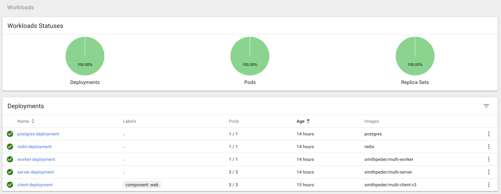

# Kubernetes on minikube

> Learning k8s and kubectl with a client/server/worker project by playing with pods, deployments, services, PVCs and ingresses.

#### About

- Client/Server/Worker deployments using ClusterIP services
- PostgreSQL using persistent volume claim for storage
- Ingress-nginx pod for routing

Using the images: [client](https://cloud.docker.com/u/smithpeder/repository/docker/smithpeder/multi-client), [server](https://cloud.docker.com/u/smithpeder/repository/docker/smithpeder/multi-server) and [worker](https://cloud.docker.com/u/smithpeder/repository/docker/smithpeder/multi-worker) built in another docker test project.

#### Dashboard

